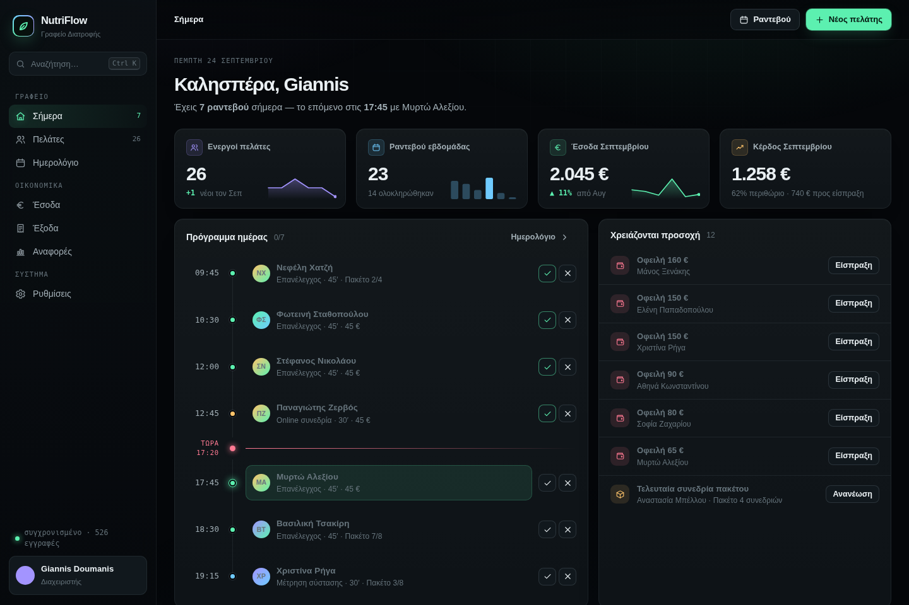
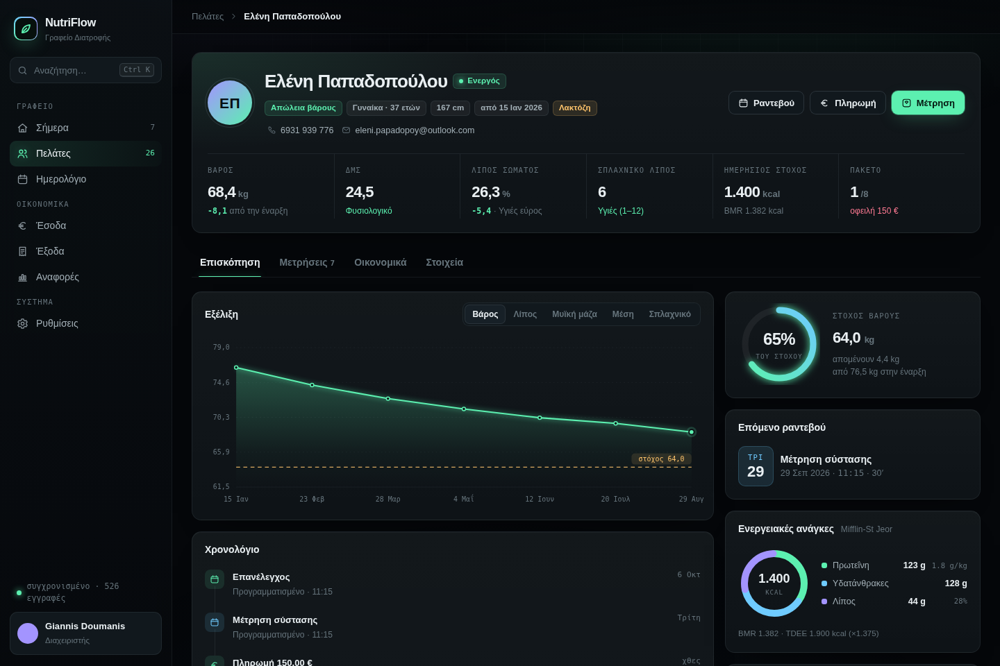
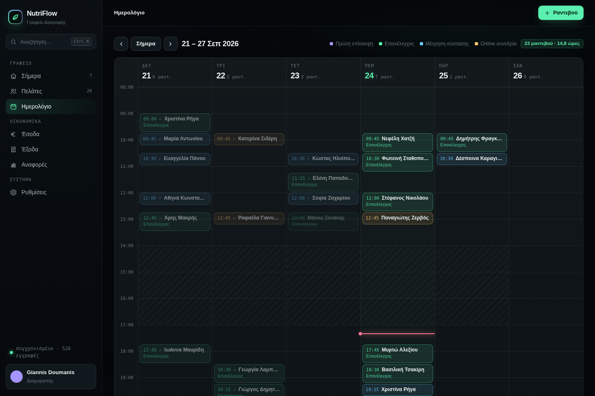
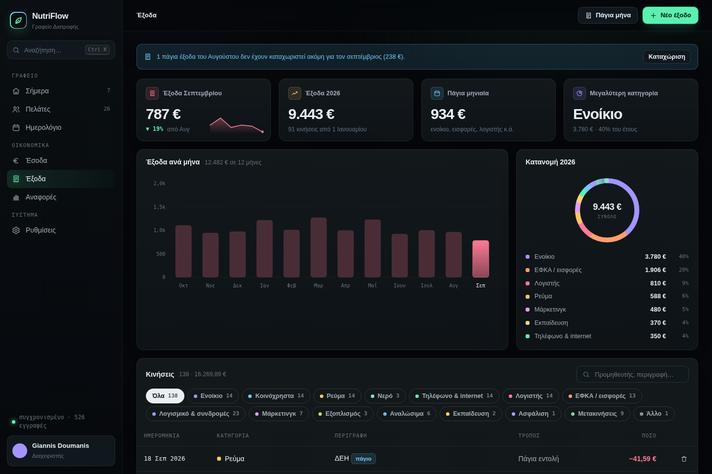
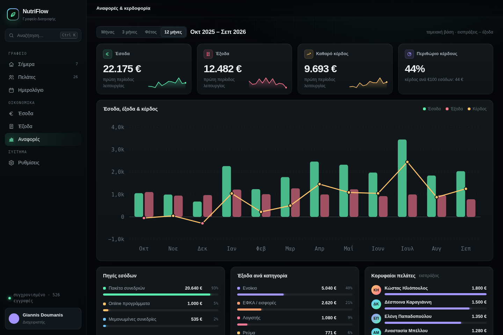

# NutriFlow

Εφαρμογή διαχείρισης διαιτολογικού γραφείου: πελάτες, ραντεβού, μετρήσεις σύστασης σώματος, πακέτα συνεδριών, έσοδα, έξοδα και αναφορές κερδοφορίας. Πλήρως στα ελληνικά, σκούρο θέμα, λειτουργεί σε υπολογιστή και κινητό.



## Λειτουργίες

| Ενότητα | Τι κάνει |
|---|---|
| **Σήμερα** | Πρόγραμμα ημέρας με ένδειξη «τώρα» και ολοκλήρωση ραντεβού με ένα κλικ, έσοδα & κέρδος μήνα, λίστα «Χρειάζονται προσοχή» (οφειλές, πακέτα που τελειώνουν, πελάτες χωρίς ραντεβού, αύξηση βάρους, γενέθλια) |
| **Πελάτες** | Φίλτρα, αναζήτηση, τάση βάρους, πρόοδος προς στόχο, πακέτο, επόμενο ραντεβού, υπόλοιπο |
| **Καρτέλα πελάτη** | Μετρήσεις τύπου Tanita (βάρος, λίπος, μυϊκή μάζα, νερό, σπλαχνικό λίπος, περίμετροι), γράφημα εξέλιξης, ΔΜΣ, BMR / TDEE (Mifflin-St Jeor), χρονολόγιο, οικονομικά |
| **Ημερολόγιο** | Εβδομαδιαίο πρόγραμμα με ώρες, σπαστό ωράριο, κλικ σε κενή ώρα για νέο ραντεβού, έλεγχος επικάλυψης |
| **Έσοδα** | Πακέτα συνεδριών (αυτόματη αφαίρεση συνεδρίας), μεμονωμένες χρεώσεις, πληρωμές, τρόποι πληρωμής, οφειλές |
| **Έξοδα** | 15 κατηγορίες γραφείου, πάγια μηνιαία έξοδα με ένα κλικ, γραφήματα και φίλτρα |
| **Αναφορές** | Έσοδα, έξοδα, καθαρό κέρδος, περιθώριο, πηγές εσόδων, κορυφαίοι πελάτες, κόστος ανά συνεδρία, νεκρό σημείο, εξαγωγή CSV για λογιστή |
| **Κλείδωμα οικονομικών** | PIN που κρύβει έσοδα, έξοδα, αναφορές και οφειλές (κλείδωμα προβολής) |
| **Γενικά** | Αναζήτηση & εντολές με ⌘K / Ctrl K, συντομεύσεις πληκτρολογίου, πλήρης προσαρμογή σε κινητό |

| | |
|---|---|
|  |  |
|  |  |

## Δομή

```
src/
  shell.html        CSS και σκελετός σελίδας
  core.js           βοηθητικά, κατάσταση, υπολογισμοί, βάση δεδομένων, γραφήματα
  views.js          όλες οι οθόνες
  app.js            παράθυρα, αναζήτηση ⌘K, events, εκκίνηση
  foods.json        βάση τροφίμων (δεν χρησιμοποιείται στο UI αυτή τη στιγμή)
  demo-runtime.js   προσομοίωση βάσης για το αυτόνομο demo
data/demo/          δεδομένα επίδειξης (30 πελάτες, 14 μήνες κινήσεων) — όλα φανταστικά
scripts/            build και γεννήτριες δεδομένων επίδειξης
dist/               έτοιμα αρχεία (παράγονται από το build)
```

## Build

Χρειάζεται μόνο Python 3.

```bash
python3 scripts/build.py
```

Παράγει:

- **`dist/index.html`** — αυτόνομο demo. Ανοίγει με διπλό κλικ ή μέσω GitHub Pages. Τα δεδομένα επίδειξης είναι ενσωματωμένα και οι αλλαγές δεν αποθηκεύονται.
- **`dist/nutriflow-artifact.html`** — η κανονική έκδοση, για δημοσίευση ως Claude Artifact με μόνιμη βάση δεδομένων (collections: `clients`, `measurements`, `appointments`, `packages`, `payments`, `expenses`, `settings`).

## Live demo με GitHub Pages

Settings → Pages → Source: *Deploy from a branch* → Branch: `main`, φάκελος `/ (root)`. Το demo θα είναι στο `https://<username>.github.io/<repo>/dist/`.

## Σημειώσεις

- Χωρίς εξωτερικές βιβλιοθήκες: vanilla JavaScript και inline SVG γραφήματα. Γραμματοσειρές Commissioner και JetBrains Mono από Google Fonts.
- Οι υπολογισμοί (ΔΜΣ, BMR, θερμιδικοί στόχοι) είναι εκτιμήσεις για χρήση από επαγγελματία υγείας.
- Όλα τα πρόσωπα και τα ποσά στα δεδομένα επίδειξης είναι φανταστικά.
